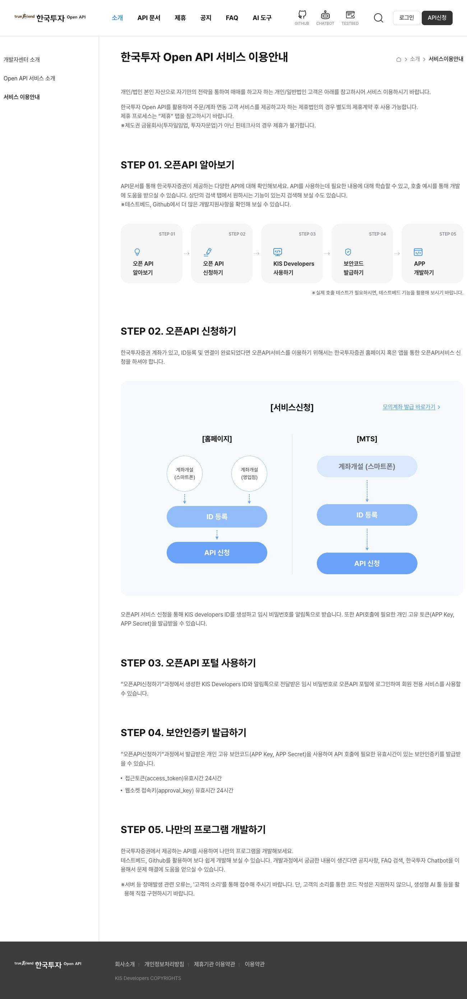
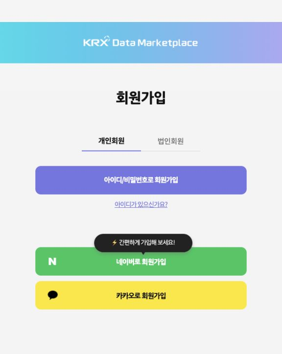
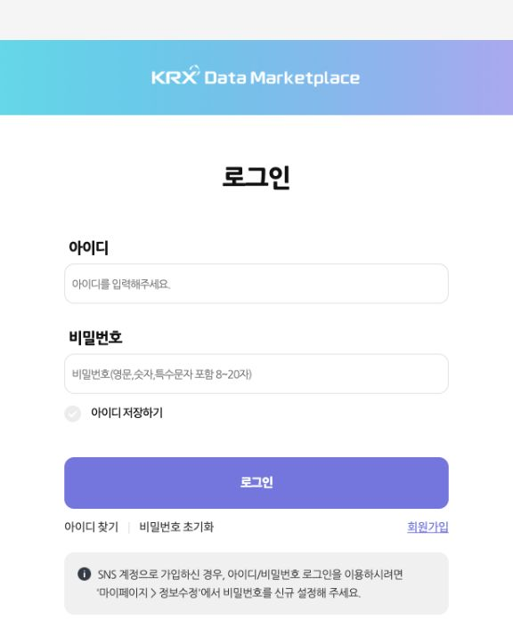

# EUKK Trading 사용 설명서

한국·미국 주식의 데이터 준비, 종목 선별, 백테스트, 자동매매를 관리하는 **PC용 프로그램**입니다. Windows 또는 macOS에 설치해 사용하며 Python 설치나 프로그래밍 지식은 필요하지 않습니다.

**[최신 버전 다운로드](https://github.com/OverDlive/AutoTrading_Local-releases/releases/latest)** · **[v1.4.0 배포 내역](https://github.com/OverDlive/AutoTrading_Local-releases/releases/tag/v1.4.0)** · **[문제 해결](#troubleshooting)**

> 설명 기준: **공개 배포판 v1.4.0**, 공식 사이트 확인·화면 촬영: **2026-09-28**. 사이트 메뉴와 제공 조건은 변경될 수 있습니다. 로그인 이후 본인 인증·발급·비밀번호 변경 완료 화면은 개인 계정으로 직접 확인하지 않았으며, 해당 구간은 공식 안내와 화면 지시에 따라 진행하도록 적었습니다.
>
> 처음에는 **데이터 준비 → 백테스트 → 모의투자** 순서로 사용하세요. 실계좌 모드는 실제 돈으로 주문할 수 있습니다. 백테스트 수익률과 모의 체결은 실제 수익·체결을 보장하지 않습니다.

<a id="contents"></a>
## 목차

1. [무엇을 준비해야 하나요?](#prepare)
2. [다운로드와 설치](#install)
3. [처음 실행했을 때 보는 화면](#screens)
4. [한국투자증권 API 발급 및 앱 연결](#kis)
5. [KRX 계정 만들기 — pykrx 설정](#krx)
6. [KRX 비밀번호 변경·초기화·SNS 계정](#krx-password)
7. [토스증권 API 연결 — 선택 사항](#toss)
8. [종목 목록·가격 데이터 준비](#data)
9. [스크리닝으로 종목 선별](#screening)
10. [첫 백테스트와 결과 읽기](#backtest)
11. [모의 자동매매 시작](#paper)
12. [실계좌 실행·중지·복구](#live)
13. [업데이트·백업·PC 이전](#maintenance)
14. [문제 해결과 자주 묻는 질문](#troubleshooting)
15. [용어 사전·공식 자료·버전 안내](#references)

<a id="prepare"></a>
## 1. 무엇을 준비해야 하나요?

### 계정과 키는 용도가 다릅니다

| 준비물 | 용도 | 언제 필요한가요? |
| --- | --- | --- |
| EUKK Trading 실행 파일 | 프로그램 실행 | 모든 사용자 |
| 인터넷 연결 | 시세·과거 데이터 조회, 증권사 연결, 업데이트 | 해당 기능을 사용할 때 |
| 한국투자증권 계좌 + Open API의 App Key / App Secret | 한국투자 시세·계좌 조회·지원 모드의 주문 | 한국투자를 연결할 때 |
| KRX Data Marketplace 아이디 / 비밀번호 | pykrx를 통한 한국거래소 데이터 인증 | KRX 인증을 요구하는 데이터를 조회할 때 |
| 토스증권 Client ID / Client Secret / 계좌 ID | 토스 시세·계좌 연동 | 토스를 사용할 때만 |
| FMP API Key | 미국 **과거 시가총액** 데이터 | 해당 데이터를 요구하는 기능을 사용할 때만 |
| GitHub 계정 / GitHub 토큰 | 다운로드·업데이트 | **필요 없음** |

**pykrx 자체에는 회원가입이 없습니다.** pykrx는 한국 주식 정보를 읽는 Python 라이브러리이며, 앱에 넣는 계정은 **한국거래소 KRX Data Marketplace 계정**입니다. KRX Open API 인증키와 한국투자 API 키도 서로 다른 정보입니다.

KRX 계정만으로 증권사 주문이나 모든 실시간 시세 기능을 이용할 수는 없습니다. 반대로 증권사 API 키를 KRX 비밀번호 칸에 넣어도 로그인되지 않습니다.

### 초보자용 진행 순서

1. 내 PC에 맞는 배포 파일을 설치합니다.
2. 사용할 증권사 API를 발급받고 앱에서 연결 테스트를 합니다.
3. 한국 시장 데이터를 사용할 경우 KRX 계정을 등록하고 로그인 확인을 합니다.
4. 종목 목록과 과거 일봉을 준비합니다.
5. 작은 범위로 백테스트를 한 번 완료합니다.
6. 모의투자를 실행해 상태·주문·체결·중지를 익힙니다.
7. 실계좌를 사용할 때는 지원 전략과 계좌·자금 설정을 다시 확인합니다.

<a id="install"></a>
## 2. 다운로드와 설치

### 2-1. 어떤 파일을 받아야 하나요?

[최신 릴리스](https://github.com/OverDlive/AutoTrading_Local-releases/releases/latest)를 열고 **Assets** 목록을 펼칩니다. 아래는 v1.4.0의 파일입니다. 새 버전에서는 파일명의 버전 숫자가 달라집니다.

| PC | 파일 |
| --- | --- |
| Windows x64 | [EUKK-Trading-1.4.0-windows-x64.zip](https://github.com/OverDlive/AutoTrading_Local-releases/releases/download/v1.4.0/EUKK-Trading-1.4.0-windows-x64.zip) |
| M1·M2 등 Apple Silicon Mac | [EUKK-Trading-1.4.0-macos-arm64.tar.gz](https://github.com/OverDlive/AutoTrading_Local-releases/releases/download/v1.4.0/EUKK-Trading-1.4.0-macos-arm64.tar.gz) |
| Intel Mac | [EUKK-Trading-1.4.0-macos-x64.tar.gz](https://github.com/OverDlive/AutoTrading_Local-releases/releases/download/v1.4.0/EUKK-Trading-1.4.0-macos-x64.tar.gz) |

- Mac은 **Apple 메뉴 → 이 Mac에 관하여**에서 칩 또는 프로세서를 확인합니다.
- Windows는 **설정 → 시스템 → 정보 → 시스템 종류**에서 x64 여부를 확인합니다. Windows ARM 전용 배포판은 제공하지 않습니다.
- <strong>Source code (zip/tar.gz)</strong>는 실행 프로그램이 아닙니다.
- `.sha256`는 파일이 손상되지 않았는지 확인할 때 사용하는 체크섬 파일이며 실행 파일이 아닙니다.
- Linux·스마트폰용 설치 파일은 제공하지 않습니다.

### 2-2. Windows

1. 다운로드한 ZIP 파일을 마우스 오른쪽 버튼으로 누르고 **모두 압축 풀기**를 선택합니다.
2. 압축 해제가 끝난 폴더를 전용 설치 위치에 둡니다. 예: `%LOCALAPPDATA%\Programs\EUKK Trading`.
3. 압축을 푼 폴더 안의 **EUKK Trading.exe**를 실행합니다.
4. 실행 파일 옆의 `_internal` 폴더를 함께 보관합니다. EXE 파일만 바탕화면에 옮기면 실행되지 않을 수 있습니다. 바탕화면에서는 바로가기를 사용하세요.
5. 첫 화면이 열리면 설치가 완료된 것입니다. 아직 계좌 연결이나 자동매매가 완료된 것은 아닙니다.

### 2-3. macOS

1. 칩에 맞는 `.tar.gz`를 내려받고 Finder에서 더블클릭하여 압축을 풉니다.
2. **EUKK Trading.app**을 응용 프로그램 폴더로 옮깁니다.
3. 앱을 실행합니다. 자동 업데이트를 사용하려면 설치 폴더의 부모 디렉터리에 쓰기 권한이 있어야 합니다.
4. 권한 때문에 업데이트가 실패하면 쓰기 가능한 사용자 전용 설치 위치를 사용합니다. 앱 데이터 폴더에 실행 파일을 섞어 넣지는 마세요.

현재 배포판은 Windows 코드 서명과 Apple 개발자 서명·공증을 포함하지 않습니다. 실행 제한이 나오면 먼저 이 저장소의 공식 릴리스에서 받은 파일인지 확인하고 운영체제의 보안 안내를 따르세요. 파일 손상·악성코드 경고가 있으면 억지로 실행하지 말고 재다운로드와 출처 확인부터 하세요.

### 2-4. 선택: 체크섬 확인

배포 파일과 같은 이름의 `.sha256`를 내려받습니다. 아래 명령의 파일명은 실제 다운로드한 이름으로 바꿉니다. 표시되는 해시가 `.sha256` 파일에 적힌 값과 일치해야 합니다.

Windows PowerShell:

```powershell
Get-FileHash "$HOME\Downloads\EUKK-Trading-1.4.0-windows-x64.zip" -Algorithm SHA256
```

macOS 터미널:

```bash
shasum -a 256 "$HOME/Downloads/EUKK-Trading-1.4.0-macos-arm64.tar.gz"
```

<a id="screens"></a>
## 3. 처음 실행했을 때 보는 화면

앱 버전에 따라 한글·영문 표기가 함께 쓰입니다. 기능 이름으로 찾아주세요.

| 화면 | 여기서 하는 일 | 처음 확인할 내용 |
| --- | --- | --- |
| Overview | 시장·계좌·운영 상태 요약 | 데이터가 없거나 연결 전인 상태인지 |
| Account & Data | 증권사·KRX 계정 설정, 데이터 준비 | 저장과 연결 확인은 각각 했는지 |
| Screening | 기준일의 조건에 맞는 종목 선별 | 시장·날짜·전략·제외 사유 |
| Backtest Lab | 과거 기간의 가상 매매·결과 분석 | 기간·자본·비용·데이터 범위 |
| Live Trading | 모의/실계좌 자동매매 세션 관리 | 모드·계좌·시장·배정 자금 |
| Preferences / 환경 설정 | 테마·백그라운드·백업·업데이트 | 창 닫기 동작과 저장 위치 |

**“안전하게 저장”은 PC에 정보를 보관하는 동작입니다. “연결 테스트” 또는 “로그인 확인”까지 성공해야 현재 정보가 유효한지 알 수 있습니다.** 저장 후 입력칸이 비워지는 것은 보안 처리를 위한 정상 동작입니다. 카드의 저장 상태와 마스킹된 식별자를 확인하세요.

<a id="kis"></a>
## 4. 한국투자증권 API 발급 및 앱 연결

### 4-1. 먼저 준비할 것

본인 명의 한국투자증권 계좌, 계좌에 연결된 고객 ID, 증권사에서 요구하는 본인 인증 수단을 준비합니다. 계좌가 없다면 한국투자증권 공식 앱·홈페이지의 계좌개설 안내를 먼저 완료하세요. 모바일로 계좌만 만들고 홈페이지용 ID 등록·계좌 연결이 끝나지 않은 경우 그 절차도 필요합니다.

공식 경로: [KIS Developers 서비스 이용안내](https://apiportal.koreainvestment.com/about-howto) → **STEP 02. 오픈API 신청하기**. 이 페이지의 홈페이지/MTS 링크로 이동하면 메뉴를 찾기 쉽습니다.

<details>
<summary>실제 사이트 예시: 한국투자 Open API 신청 순서 펼치기</summary>



출처: 한국투자증권 KIS Developers의 공개 서비스 이용안내. 2026-09-28 촬영. 개인 계좌·키가 표시되지 않은 화면입니다.

</details>

### 4-2. 실전용 API 신청

1. 공식 안내의 **API 신청** 또는 사이트 상단 **API신청**을 누릅니다. [한국투자증권 API 신청 페이지](https://securities.koreainvestment.com/main/customer/systemdown/RestAPIService.jsp)로 연결됩니다.
2. 한국투자증권 홈페이지 또는 공식 앱에서 요구하는 방식으로 로그인합니다. ID 로그인만으로 신청이 제한되면 화면에 제시된 본인 인증 방법을 사용합니다.
3. Open API 서비스 신청 화면에서 연결할 **본인 계좌**를 확인합니다. 실전 계좌와 모의 계좌를 혼동하지 마세요.
4. 화면에 나온 이용 조건·약관을 읽고 신청을 완료합니다. 신청 과정에서 KIS Developers ID를 만들고 임시 비밀번호를 알림톡으로 받는 절차가 안내됩니다.
5. 발급된 **App Key**와 **App Secret**을 확인합니다. 키를 다시 조회하는 메뉴·인증 방식은 로그인 후 표시되는 신청·발급 화면을 따릅니다.
6. 연결 계좌의 **앞 8자리 계좌번호**와 **뒤 2자리 상품코드**를 확인합니다.
7. 아래 4-4 절에 따라 앱의 **실전 계좌 (PROD)** 카드에 저장합니다.

KIS Developers 포털의 로그인 비밀번호, 증권사 고객 ID 비밀번호, 계좌 비밀번호, App Secret은 서로 다릅니다. **EUKK Trading의 App Secret 칸에는 발급받은 API 비밀키를 입력합니다.**

### 4-3. 한국투자 모의투자 API 신청

1. [공식 서비스 이용안내](https://apiportal.koreainvestment.com/about-howto)의 **모의계좌 발급 바로가기**에서 모의투자 참가·계좌 발급 절차를 진행합니다.
2. 발급된 모의투자 계좌와 이용 기간을 확인합니다.
3. Open API 신청에서 **모의투자용** 계좌를 대상으로 키를 발급받습니다.
4. 모의투자용 키·계좌는 앱의 **모의 계좌 (VTS)** 카드에 입력합니다. PROD 키를 복사해 넣지 마세요.
5. VTS 연결에 성공해도 실시간 시세를 위한 PROD 연결이 추가로 필요할 수 있습니다. 이 앱 v1.4.0의 한투 VTS 세션은 한투 PROD 시세 연결을 사용합니다. [모의매매 안내](#paper)를 함께 읽으세요.

모의계좌 만료와 API 키의 유효기간은 같은 개념이 아닙니다. 모의 주문 불가 오류가 발생하면 증권사에서 모의계좌 유효 상태부터 확인하세요.

### 4-4. 앱에 입력하기

<strong>Account & Data → 실전 계좌 (PROD) 또는 모의 계좌 (VTS)</strong>에서 다음을 입력합니다.

| 앱 입력칸 | 입력 내용 | 흔한 실수 |
| --- | --- | --- |
| App Key | 선택한 환경에서 발급받은 App Key | PROD와 VTS를 바꿈 |
| App Secret | 같은 발급 쌍의 App Secret | 로그인 비밀번호를 입력함 |
| 계좌번호 | 앞 8자리 숫자 | 하이픈과 상품코드까지 모두 입력함 |
| 상품코드 | 뒤 2자리 코드 | 기본값 01을 확인 없이 사용함 |

**형식 설명용 가상 예시:** 계좌가 `12345678-01`로 표시된다면 계좌번호에는 `12345678`, 상품코드에는 `01`을 넣습니다. 실제 입력은 반드시 본인 계좌 정보를 사용하세요.

1. 복사·붙여넣기한 키의 앞뒤 공백과 줄바꿈을 확인합니다.
2. **안전하게 저장**을 누릅니다.
3. **연결 테스트**를 누릅니다.
4. 카드의 연결 상태·마지막 검증 시각·오류 내용을 확인합니다.
5. 필요에 따라 **KIS 활성 환경**을 `실전 (PROD)` 또는 `모의 (VTS)`로 선택합니다. 이후 세션 시작 화면에서도 모드와 계좌를 별도로 확인해야 합니다.
6. 실패하면 키·계좌·환경의 조합을 다시 확인한 뒤 재시도합니다. 성공할 때까지 시작 버튼을 반복해서 누르지 마세요.

접근토큰(access token)은 앱이 API 연결 과정에서 처리합니다. 사용자가 토큰을 매일 복사하거나 별도 서버를 만들 필요는 없습니다. 키를 재발급했다면 기존 세션을 중지하고 새 키를 저장한 뒤 연결 테스트를 다시 합니다.

<a id="krx"></a>
## 5. KRX 계정 만들기 — pykrx 설정

### 5-1. 정확한 사이트 열기

[KRX Data Marketplace](https://data.krx.co.kr)에 접속합니다. 앱의 **KRX 사이트** 버튼으로도 열 수 있습니다. 상단 **회원가입**을 선택하세요.

이 앱의 KRX 카드에는 **아이디와 비밀번호**를 넣습니다. 별도의 KRX Open API 인증키 신청이나 pykrx 설치 명령은 필요하지 않습니다.

### 5-2. 아이디·비밀번호 방식으로 가입하기

1. [회원가입 화면](https://data.krx.co.kr/contents/MDC/COMS/client/MDCCOMS002_S0.cmd)을 엽니다.
2. 일반 개인 사용자는 **개인회원** 탭을 확인합니다.
3. **아이디/비밀번호로 회원가입**을 선택합니다.
4. 이어지는 사이트 안내에 따라 약관 확인, 요구되는 본인 인증, 회원정보 입력을 완료합니다. 인증 방법·필수 항목은 실제 사이트에 표시되는 내용을 기준으로 하세요.
5. 사용할 아이디와 비밀번호를 안전하게 보관합니다. 다른 사이트와 동일한 비밀번호를 재사용하지 않는 것이 좋습니다.
6. 가입이 끝나면 [로그인 화면](https://data.krx.co.kr/contents/MDC/COMS/client/MDCCOMS001.cmd)에서 **아이디와 비밀번호를 직접 입력하는 방식**으로 로그인해 봅니다.
7. 웹 로그인이 성공하면 앱 등록으로 넘어갑니다. 추가 인증이나 비밀번호 변경 안내가 나오면 웹에서 먼저 처리합니다.



출처: KRX Data Marketplace 공개 회원가입 화면, 2026-09-28 촬영. **네이버·카카오 버튼과 아이디 가입 버튼을 구분하세요.** SNS로 이미 가입한 경우에는 중복 가입하기 전에 [다음 절](#krx-password)을 확인하세요.

### 5-3. EUKK Trading에 등록하기

1. **Account & Data**를 엽니다.
2. **KRX 데이터 계정 · pykrx** 카드를 찾습니다.
3. **아이디**에 KRX 로그인 아이디를 입력합니다.
4. **비밀번호**에 방금 웹에서 로그인에 성공한 KRX 비밀번호를 입력합니다.
5. **안전하게 저장**을 누릅니다. 저장되면 입력칸이 비워지고 카드에는 저장된 아이디가 마스킹되어 표시됩니다.
6. **로그인 확인**을 누릅니다.
7. **로그인 확인됨**과 마지막 로그인 확인 시각을 확인합니다.

| 카드 표시 | 의미 | 다음 행동 |
| --- | --- | --- |
| 저장 안 됨 | 등록된 정보가 없음 | 아이디·비밀번호 입력 후 저장 |
| 저장됨 · 로그인 확인 전 | PC에 보관했지만 인증은 확인 전 | 로그인 확인 클릭 |
| 로그인 확인됨 | 저장된 계정의 로그인 확인 성공 | 데이터 준비 진행 |
| 로그인 확인 실패 | 인증 또는 연결에 문제 | 오류 안내와 웹 로그인 확인 |

**로그인 확인 버튼이 비활성화되어 있나요?** 입력칸에 아직 저장하지 않은 내용이 있으면 먼저 저장해야 합니다. 아이디와 비밀번호를 모두 넣어 저장한 뒤 확인하세요.

**저장 정보 삭제**는 이 PC에 저장한 KRX 정보를 지우는 기능입니다. KRX 사이트 회원탈퇴나 비밀번호 변경 기능이 아닙니다.

<a id="krx-password"></a>
## 6. KRX 비밀번호 변경·초기화·SNS 계정

### 6-1. 네이버·카카오로 가입한 경우

KRX 실제 로그인 화면은 SNS 가입자가 아이디/비밀번호 로그인을 사용하려면 **마이페이지 → 정보수정**에서 비밀번호를 신규 설정하도록 안내합니다.

1. KRX 사이트에서 원래 사용하던 **네이버 또는 카카오 로그인**을 합니다.
2. **마이페이지 → 정보수정**을 엽니다.
3. 화면 안내에 따라 KRX 아이디를 확인하고 **KRX 아이디 로그인에 사용할 비밀번호**를 설정합니다. 네이버·카카오 계정 자체의 비밀번호를 앱에 입력하지 마세요.
4. KRX에서 로그아웃한 뒤 **아이디/비밀번호** 방식으로 다시 로그인해 봅니다.
5. 성공한 KRX 아이디·비밀번호를 앱에 저장하고 **로그인 확인**을 실행합니다.



출처: KRX Data Marketplace 공개 로그인 화면, 2026-09-28 촬영. 아래 회색 안내 상자에서 SNS 회원의 설정 경로를 확인할 수 있습니다.

### 6-2. 현재 비밀번호를 알고 변경하려는 경우

1. 데이터 조회 작업이 진행 중이면 완료하거나 중지합니다.
2. KRX 웹사이트에 로그인하고 **마이페이지 → 정보수정**에서 비밀번호 관련 항목을 찾습니다.
3. 사이트가 요구하는 현재 비밀번호·본인 인증·새 비밀번호 확인 절차를 진행합니다. 로그인 후 상세 화면의 버튼 이름과 요구 항목은 미확인이므로 화면 안내를 따릅니다.
4. 변경 완료 후 로그아웃하고 **새 비밀번호로 웹 로그인이 되는지** 확인합니다.
5. 앱의 **KRX 데이터 계정 · pykrx**에 **아이디와 새 비밀번호를 모두 다시 입력**합니다.
6. **안전하게 저장 → 로그인 확인** 순서로 누릅니다.
7. 로그인 확인이 성공하면 실패했던 데이터 조회를 다시 실행합니다.

**웹에서 비밀번호를 바꿔도 앱에 저장된 비밀번호는 자동으로 바뀌지 않습니다.** 앱에서 새 값으로 덮어 저장해야 합니다.

### 6-3. 비밀번호를 잊어버린 경우

1. [KRX 로그인 화면](https://data.krx.co.kr/contents/MDC/COMS/client/MDCCOMS001.cmd)을 엽니다.
2. **아이디를 먼저 입력한 다음 `비밀번호 초기화`를 누릅니다.** 확인 시점에는 아이디 없이 누르면 아이디 필수입력 안내가 표시되었습니다.
3. 아이디도 모르면 먼저 **아이디 찾기**를 사용합니다.
4. 사이트가 요구하는 본인 확인을 직접 완료하고 초기화·재설정 안내를 따릅니다. 임시 비밀번호 제공 여부와 인증 방식은 계정에 따라 실제 화면에서 확인하세요.
5. 새 비밀번호로 웹 로그인한 다음 앱에도 다시 저장합니다.

### 6-4. “KRX 사이트에서 비밀번호를 변경한 뒤…” 오류

앱의 오류 코드 `KRX_PASSWORD_CHANGE_REQUIRED`는 웹사이트에서 비밀번호 조치가 필요하다는 뜻입니다.

**웹 로그인 → 사이트의 비밀번호 변경 절차 완료 → 새 비밀번호로 웹 로그인 확인 → 앱에 다시 저장 → 로그인 확인** 순서로 처리합니다. 앱에서 같은 비밀번호를 여러 번 저장하는 것으로는 해결되지 않습니다.

기존 개인회원 전환 안내가 나오면 KRX 화면에 표시된 **아이핀 인증 또는 휴대폰 인증을 통한 아이디 생성** 안내를 확인하세요. 가입 여부가 불확실하면 새 계정을 계속 만들지 말고 KRX 회원 지원 안내를 이용하세요.

<a id="toss"></a>
## 7. 토스증권 API 연결 — 선택 사항

한국투자만 사용한다면 이 절은 건너뛰어도 됩니다. 토스 계정은 KIS PROD/VTS 설정과 별개입니다.

1. [토스증권 공식 Open API 가이드](https://developers.tossinvest.com/docs)의 **시작하기**를 확인합니다.
2. 토스증권 <strong>WTS(웹 트레이딩 서비스)</strong>에 본인 계정으로 로그인합니다.
3. **설정 → Open API**에서 클라이언트를 등록하고 **Client ID / Client Secret**을 발급받습니다.
4. 같은 화면의 **허용 IP 관리**에 앱을 실행할 PC가 사용하는 **공인 IP**를 등록합니다. `192.168.x.x` 같은 공유기 내부 주소와 혼동하지 마세요. 네트워크·VPN 변경 후에는 외부에 보이는 IP가 달라질 수 있습니다.
5. API용 <strong>계좌 ID(accountSeq)</strong>를 확인합니다. 일반 계좌번호와 다른 값입니다. 화면에서 찾을 수 없다면 [공식 Account 안내](https://developers.tossinvest.com/docs/account)의 계좌 목록 조회 안내나 토스 지원 경로를 이용하세요. 특정 숫자로 추측하지 마세요.
6. 앱의 **Account & Data → 토스증권 · 실계좌 (REAL)** 카드에 세 값을 입력합니다.
7. **안전하게 저장 → 연결 테스트**를 누릅니다.
8. 마지막 확인 시각과 KRW·USD 가용현금 또는 오류를 확인합니다. 조회 실패를 잔액 0원으로 해석하지 마세요.

앱이 토큰 발급을 처리하므로 초보자가 문서의 API 호출 예제를 터미널에서 실행할 필요는 없습니다. 공식 사이트가 제공하는 전체 API 기능과 EUKK Trading 배포판이 지원하는 기능은 다를 수 있습니다. 실제 주문은 앱의 지원 모드·전략 제한을 따릅니다.

<a id="data"></a>
## 8. 종목 목록·가격 데이터 준비

### 8-1. 한국 종목 목록과 일봉

**종목 마스터**는 종목 코드·이름 등의 목록이고, **일봉**은 하루의 시가·고가·저가·종가·거래량입니다. 목록만 내려받았다고 가격 데이터까지 모두 준비된 것은 아닙니다.

1. **Account & Data**에서 **종목 마스터 갱신**을 누릅니다.
2. 작업 완료와 종목 마스터 상태를 확인합니다.
3. **종목명 또는 코드 검색**에 종목을 입력하고 목록에서 선택합니다.
4. **선택 종목 일봉 갱신**을 실행합니다.
5. **일봉 캐시 범위**, **마지막 갱신 시각**, **데이터 신선도**, **실패 원인**을 확인합니다.
6. **저장 위치 열기**로 로컬 데이터 위치를 확인할 수 있습니다. 파일을 임의 수정하지 마세요.

일목 계산에는 테스트 시작일 이전 데이터도 필요합니다. 조회가 성공했더라도 기간이 너무 짧거나 상장 이력이 부족하면 후보에서 제외될 수 있습니다. 휴장일에는 그날의 새 일봉이 없는 것이 정상입니다.

### 8-2. 미국 시장 데이터

Backtest Lab 등 사용할 화면에서 시장을 **US**로 선택하고 종목 목록을 동기화합니다. 예를 들어 Backtest Lab에는 **종목 목록 동기화**가 있습니다. Account & Data의 한국 시장 검색에서 미국 티커를 찾으려고 하지 마세요.

미국 티커·상장 이력·가격 공급자의 제공 기간에 따라 자료가 부족할 수 있습니다. 자동 데이터 준비가 끝날 때까지 기다리고, 제외된 종목과 사유를 확인합니다. 오늘의 시가총액을 과거 값으로 채우거나 잘못된 가격을 임의 수정하면 과거 검증의 의미가 달라집니다.

### 8-3. FMP 과거 시가총액 — 필요한 경우만

1. [FMP 공식 문서](https://site.financialmodelingprep.com/developer/docs)를 열고 **Sign Up**에서 계정을 만듭니다.
2. 로그인 후 계정의 API Key를 확인합니다.
3. 필요한 **Historical Market Capitalization**의 종목·날짜 범위를 계정에서 조회할 수 있는지 확인합니다. 키 발급 성공이 모든 과거 데이터 이용 권한을 뜻하지 않습니다. 요금제·이용 조건은 공식 사이트에서 확인하세요.
4. 앱의 **Account & Data → 미국 과거 시가총액**에 키를 넣고 **FMP 키 저장**을 누릅니다.
5. **과거 조회 권한 확인**으로 확인합니다.
6. 해당 권한이 없고 정확한 과거 자료를 보유했다면 **과거 시가총액 CSV 가져오기**를 사용할 수 있습니다. 앱의 형식 검증 안내를 따르세요.

FMP는 모든 사용자에게 필수인 증권사 주문 API가 아닙니다. 사용하는 기능이 요구하는 데이터부터 확인하고 준비하세요.

<a id="screening"></a>
## 9. 스크리닝으로 종목 선별

1. **Screening**에서 시장 **KR 또는 US**를 선택합니다.
2. 기준일을 선택합니다. 처음에는 데이터가 준비된 최근 완료 거래일을 사용합니다.
3. 전략과 표시되는 매개변수를 확인합니다. 처음에는 기본값으로 화면 흐름을 익힙니다.
4. 투자금, 최대 종목 수, 현금 비중 등 화면에 나온 포트폴리오 조건을 확인합니다.
5. **선별 실행**을 누르고 데이터 준비·계산 진행 상태를 기다립니다.
6. 결과에서 선정 사유뿐 아니라 위험·제외 사유와 데이터 부족 여부를 확인합니다.
7. **결과 저장**으로 보관합니다.
8. 원하는 후보를 선택해 **선택 후보를 백테스트로**, 또는 **자동 포트폴리오를 백테스트로**를 누릅니다.

선정된 종목은 매수 확정 지시가 아닙니다. 기준일 이후 가격 변동, 실제 주문 가능 금액, 시장·전략 조건에 따라 실제 행동은 달라집니다. 결과가 0개여도 데이터 부족 또는 조건 미충족일 수 있으므로 사유부터 확인하세요.

<a id="backtest"></a>
## 10. 첫 백테스트와 결과 읽기

### 10-1. 실행 순서

1. **Backtest Lab**을 엽니다.
2. 시장과 전략을 확인합니다. 선택한 전략과 운용 방식이 실제 시작 요청에 반영됩니다. 이전·시험 전략은 해당 표시 옵션을 켜서 선택합니다.
3. 직접 종목을 선택하거나 자동 구성 방식으로 진행합니다. 직접 선택할 때는 종목을 검색해 **선택 추가**를 누릅니다.
4. 처음에는 종목 수와 조회 범위를 작게 잡아 전체 흐름을 한 번 완료합니다. 예: 자료가 충분한 종목 1~3개, 과거 1년. 이 예시는 기능 연습용이며 수익성 검증에 충분한 기간이라는 뜻은 아닙니다.
5. 화면의 **다음** 버튼으로 단계를 이동하면서 전략 설정·운용 방식·핵심 ETF·투자 비중을 확인합니다.
6. 기간·초기 자본·수수료·슬리피지 등 제공되는 실행 조건을 입력합니다. KRW와 USD 단위를 구분합니다.
7. 구성 요약을 읽고 **백테스트 실행**을 누릅니다.
8. 데이터 다운로드·준비와 계산이 끝날 때까지 기다립니다. 중단하려면 **취소**를 누르고 작업 종료를 확인합니다.
9. 저장된 결과 목록에서 실행 결과를 더블클릭해 상세 분석을 엽니다.

**데이터 준비가 오래 걸릴 수 있습니다.** 최초 실행은 과거 자료 수집과 계산 준비 시간이 들며, 넓은 종목 범위일수록 시간이 늘어납니다. 같은 작업을 중복 실행하지 마세요.

### 10-2. 결과에서 확인할 항목

| 항목 | 초보자를 위한 설명 |
| --- | --- |
| 총수익률 | 시작 자본 대비 얼마나 늘거나 줄었는지 |
| 최대 낙폭(MDD) | 평가금액이 고점에서 가장 크게 떨어진 비율 |
| 벤치마크 | 비교 기준 지수·ETF의 성과 |
| 거래 횟수·매매 내역 | 수익이 어떤 거래에서 발생했는지 |
| 비용·슬리피지 | 수수료와 예상 가격 차이가 반영되었는지 |
| 종목별 성과·선택일 보유 종목 | 특정 종목이나 시기에 결과가 집중되었는지 |
| 제외·실패 내역 | 데이터 부족 등으로 평가에서 빠진 종목이 있는지 |

높은 수익률 하나만 보지 말고 낙폭·거래 수·비용·데이터 범위를 함께 읽으세요. 전략의 판단을 공유하더라도 실시간 매매의 체결·거래 시간·데이터·비용 조건 때문에 백테스트와 실제 결과는 같지 않을 수 있습니다.

<a id="paper"></a>
## 11. 모의 자동매매 시작

### 11-1. 세 가지 모드를 구분하세요

| 방식 | 주문·체결을 처리하는 곳 | 실제 자금 | v1.4.0 시세 연결 |
| --- | --- | --- | --- |
| 로컬 모의 | 앱 내부 시뮬레이션 | 사용하지 않음 | 한투 PROD 또는 토스 연결 |
| 한국투자 VTS | 한국투자 모의투자 서버 | 모의 자금 | 한투 PROD 연결 사용 |
| 실계좌 | 선택한 증권사 실계좌 | **실제 자금 사용 가능** | 지원 증권사 연결 |

**로컬 모의도 실시간 데이터 공급자 연결이 필요합니다.** 시세용 PROD 키를 저장했다는 사실만으로 모의 세션이 실계좌 세션이 되는 것은 아닙니다. 하지만 실계좌로 모드를 바꾸면 실제 주문이 가능하므로 시작 화면의 **모드와 선택 계좌**를 반드시 확인하세요.

로컬 모의 체결 방식은 전략과 실행 설정에 따라 다릅니다. 모듈형 실행은 후속 시세 이벤트와 설정된 비용을 사용하며, 기존 단순 모의 경로와 동일하지 않습니다. 어느 경우에도 실제 증권사의 체결·지연·유동성을 그대로 재현한다고 해석하면 안 됩니다.

### 11-2. 첫 세션 만들기

1. **Account & Data**에서 필요한 시세 공급자 연결을 확인합니다. VTS를 쓸 때는 VTS 계좌 연결도 확인합니다.
2. **Live Trading**에서 새 세션을 여는 버튼을 누릅니다.
3. **새 매매 세션**에서 시장을 선택합니다. 처음에는 KR 또는 US 한 시장부터 흐름을 익힙니다.
4. 모드를 **모의투자**로 선택합니다.
5. 사용할 **로컬 모의 또는 한투 모의계좌**를 확인합니다. 선택 불가 안내가 나오면 계좌 설정·데이터 연결을 먼저 해결합니다.
6. 전략·운용 방식·핵심 ETF·배분 비중을 확인합니다. 시험 전략에는 실전 제한이 있을 수 있습니다.
7. 시장별 투자금과 매수 자산 비율, 최대 종목 수 등을 확인합니다. 미국 시장은 표시된 USD 단위를 확인합니다.
8. 구성 요약과 확인 내용을 읽고 **모의 매매 시작**, 이어서 확인 화면의 **동의하고 모의 매매 시작**을 누릅니다.
9. 데이터 준비가 완료되고 세션 상태가 바뀌는 것을 기다립니다.
10. 시장별 상태, 최근 데이터, 판단 사유, 주문·체결 내역을 확인합니다. 연습을 마치면 세션 중지 기능으로 종료합니다.

시작 직후 주문이 없을 수 있습니다. 장이 닫혔거나 신호·자금·데이터 조건을 만족하지 않을 수 있으며, 전략은 확정 데이터와 실행 조건에 따라 판단합니다. **RUNNING 표시만으로 주문 접수나 체결을 확인한 것은 아닙니다.**

<a id="live"></a>
## 12. 실계좌 실행·중지·복구

### 12-1. 실행 전 확인

- [ ] 연결 테스트가 성공한 본인 계좌인지 확인했습니다.
- [ ] **실계좌** 모드와 증권사·시장 선택을 확인했습니다.
- [ ] 기존 보유 종목·미체결 주문·사용 가능한 현금을 확인했습니다.
- [ ] 시장별 투자금과 매수 비중·최대 종목 수를 이해했습니다.
- [ ] 앱에서 선택한 전략·운용 방식의 실전 지원 여부를 확인했습니다.
- [ ] 모의 실행에서 시작·상태 확인·중지 방법을 익혔습니다.
- [ ] PC 전원·인터넷·절전 설정을 확인했습니다.

**Live Trading → 새 매매 세션 → 실계좌**에서 계좌를 고르고 잔액을 조회합니다. 구성과 위험 확인, 앱이 요구하는 대사 절차를 완료한 후 시작합니다. 앱이 지원하지 않는 조합이나 복구 필요 상태를 표시하면 안내를 해결한 뒤 진행하세요.

### 12-2. 국장과 미장 함께 사용하기

시장별 세션 상태와 자금 배정을 각각 확인합니다. 한국과 미국은 시간대·거래일·휴장일이 다르므로 한 시장의 정상 상태가 다른 시장의 정상 상태까지 뜻하지는 않습니다. 두 시장을 사용할 때 각 시장의 데이터와 선택 계좌를 따로 점검하세요.

### 12-3. 상태 읽기

| 상태·상황 | 의미와 확인할 내용 |
| --- | --- |
| 준비 중 | 종목·과거 데이터 등 실행 준비 중. 아직 운용 시작 전일 수 있음 |
| RUNNING / NORMAL | 세션이 동작 중. 주문 허용·접수·체결은 별도 확인 |
| 대사 / reconciliation | 앱 기록과 증권사 계좌·주문 상태를 맞추는 과정 |
| RECOVERY_REQUIRED / ORDERS_BLOCKED | 복구 확인이 필요하거나 주문이 차단된 상태 |
| 중지·실패 | 사유를 읽고 원인을 해결한 뒤 재시작 여부 결정 |

**대사**는 앱의 기록과 증권사의 실제 계좌 상태가 일치하는지 확인하는 과정입니다. 재시작 후 복구 화면이 나오면 먼저 증권사 앱에서 보유·미체결을 확인하고 EUKK Trading의 복구 안내를 따릅니다. DB 삭제로 상태를 지우고 다시 시작하지 마세요.

### 12-4. 중지와 앱 종료

1. 해당 세션의 중지 기능 또는 **전체 중지**를 사용합니다.
2. 중지 결과와 미체결·보유 상태를 확인합니다.
3. 증권사 앱에서도 이미 접수된 주문과 보유 종목을 확인합니다.
4. 필요한 주문 취소·잔고 관리는 확인된 증권사 절차에 따라 직접 처리합니다.

**자동매매 중지가 보유 주식의 전량 매도나 모든 미체결 주문의 취소를 뜻한다고 가정하지 마세요.** 이미 증권사에 접수된 주문의 최종 상태는 증권사에서 확인해야 합니다.

**환경 설정 → 일반 → 창을 닫아도 백그라운드 실행**이 켜져 있으면 창 닫기와 프로그램 종료가 다릅니다. 완전히 끝내려면 세션을 중지하고 트레이 메뉴의 **종료**를 선택하세요. PC가 꺼지거나 잠자기 상태가 되면 로컬 앱의 지속 실행을 기대할 수 없습니다.

<a id="maintenance"></a>
## 13. 업데이트·백업·PC 이전

### 13-1. 업데이트

1. **환경 설정 → 일반 → 자동 업데이트 확인**을 켜면 앱 시작 시와 6시간마다 확인합니다.
2. **환경 설정 → 업데이트**에서 새 버전과 변경 사항을 확인합니다.
3. 진행 중인 세션·백테스트·스크리닝·데이터 작업을 종료합니다. 작업 중에는 업데이트가 제한될 수 있습니다.
4. 백업을 만든 후 다운로드·설치를 진행합니다.
5. 앱의 확인 안내에 동의하고 설치 완료 후 다시 시작합니다.
6. 버전과 기존 계정·설정·결과를 확인합니다.

앱은 다운로드한 파일의 크기·SHA-256·버전·운영체제 정보를 검사합니다. GitHub 토큰은 필요하지 않습니다. 설치 위치의 쓰기 권한이 없거나 소스 실행 환경이면 자동 설치가 제한될 수 있습니다.

### 13-2. 사용자 데이터 위치

| OS | 기본 위치 |
| --- | --- |
| Windows | `%LOCALAPPDATA%\EUKK Trading` |
| macOS | `~/Library/Application Support/EUKK Trading` |

Windows는 파일 탐색기 주소 표시줄에 경로를 붙여넣습니다. macOS는 Finder의 **이동 → 폴더로 이동**에 경로를 입력합니다. 이곳에 `app.db`, 로그·데이터·실행 결과·백업·캐시 등이 저장됩니다. 설치 폴더와 구분해 관리하세요.

### 13-3. 백업과 복원

1. 작업과 세션을 안전하게 종료합니다.
2. **환경 설정 → 백업·복원**에서 백업을 생성합니다.
3. 생성된 `.eukkbackup` 파일을 안전한 별도 위치에 보관합니다.
4. 복원 전에는 현재 상태도 백업합니다.
5. 앱의 복원 기능에서 백업 파일을 선택하고 안내에 따라 진행합니다.
6. 복원 후 설정·결과·데이터 상태를 확인하고, 증권사와 KRX의 연결 테스트를 다시 합니다.

자격증명은 OS 보안 저장소의 키와 암호화 저장소를 사용합니다. **다른 PC로 백업을 옮겼다고 API 키와 비밀번호도 바로 사용할 수 있다고 가정하면 안 됩니다.** 새 PC에서 다시 입력해야 할 수 있습니다. 백업 파일도 개인 데이터이므로 공개 이슈에 첨부하지 마세요.

<a id="troubleshooting"></a>
## 14. 문제 해결과 자주 묻는 질문

| 증상 | 확인·해결 순서 |
| --- | --- |
| EXE 실행이 안 됨 | 전체 압축 해제 여부 → `_internal` 존재 → x64 파일 여부 → OS 오류 내용 확인 |
| Mac에서 실행 제한 | 칩과 파일 일치 → 공식 릴리스 출처 확인 → macOS 보안 안내 확인 |
| 저장했는데 입력칸이 비어 있음 | 정상 보안 동작일 수 있음. 카드 상태·마스킹 식별자 확인 |
| KIS 연결 실패 | PROD/VTS 카드 → 키 쌍 → 앞 8자리 계좌 → 뒤 2자리 코드 → 서비스 신청 상태 |
| VTS는 연결되는데 모의 세션 시작 실패 | 시세용 한투 PROD 연결 및 모의계좌 유효 상태 확인 |
| KRX 로그인 실패 | 브라우저에서 아이디 로그인 → SNS 전용 여부 → 변경 안내 처리 → 앱 재저장 |
| KRX 비밀번호 변경 요구 | [6절](#krx-password)의 웹 변경·앱 재저장 순서 진행 |
| KRX 로그인 확인 버튼이 안 눌림 | 아이디·비밀번호를 모두 입력하여 먼저 저장 |
| KRX 연결 실패 / `KRX_CONNECTION_FAILED` | 공식 사이트 접속과 네트워크·점검 여부 확인 후 잠시 뒤 재시도 |
| `KRX_AUTH_UNAVAILABLE` | 로그인 지원 모듈이 없는 앱일 수 있으므로 최신 공식 배포판 확인 |
| `KRX_CREDENTIALS_INVALID` | 저장 계정을 읽지 못함. 아이디·비밀번호 다시 저장 |
| 토스 403 / 허용 IP 오류 | WTS의 허용 IP와 현재 PC 공인 IP 확인. 기타 403은 권한·오류 코드도 확인 |
| 토스 계좌를 못 찾음 | 일반 계좌번호 대신 본인의 `accountSeq`인지 확인 |
| 429 / 요청 한도 초과 | 반복 클릭·중복 작업을 멈추고 제공자 안내에 따라 기다린 후 재시도 |
| 종목 검색 결과가 없음 | 시장 선택 → 종목 목록 동기화 → 코드·이름·상장 여부 확인 |
| 백테스트 데이터 부족 | 선택 기간·상장 이력·일봉 범위·계산 준비용 과거 데이터·제외 사유 확인 |
| `OHLC must be positive` / 잘못된 일봉 | 해당 종목·기간의 데이터 오류 확인. 갱신 후 재시도하고 지속되면 제보 |
| 미국 과거 시가총액 부족 | 기능의 요구 데이터 확인 → FMP 과거 조회 권한 또는 유효한 과거 CSV 확인 |
| 주문이 발생하지 않음 | 장 상태·최근 데이터·신호·자금·최대 보유 수·제한 사유 확인 |
| 복구 필요 / 주문 차단 | 증권사 보유·미체결 확인 → 앱의 대사·복구 절차 진행 |
| 업데이트 버튼 비활성화 | 거래·계산·동기화 작업 종료 여부 확인 |
| 업데이트 설치 실패 | 설치 위치 쓰기 권한·배포판 실행 여부·오류 내용 확인 |

### 자주 묻는 질문

**Q. KRX 회원가입만 하면 자동매매가 되나요?**

아니요. KRX는 데이터 인증용이고, 시세·주문을 위한 증권사 연결과 매매 세션 설정은 별도입니다.

**Q. API 키 저장이나 연결 테스트만으로 매매가 시작되나요?**

자동매매를 시작하려면 Live Trading에서 세션을 구성하고 시작 절차를 진행해야 합니다. 연결 확인과 세션 실행을 구분하세요.

**Q. 프로그램을 꺼도 서버가 대신 매매하나요?**

별도 매매 서버가 없는 로컬 프로그램입니다. 창만 닫아 백그라운드로 남는 경우를 제외하면, 앱 종료·PC 종료 후 계속 운용된다고 기대하면 안 됩니다.

**Q. 한투와 토스, KRX, FMP를 모두 가입해야 하나요?**

아니요. 사용하는 증권사와 데이터 기능에 필요한 항목을 준비합니다. 단, 모의매매에도 시세 공급자 연결이 필요합니다.

**Q. 비밀번호를 바꿨는데 계속 실패해요.**

웹에서 새 비밀번호로 **아이디 로그인**에 성공하는지 먼저 확인하세요. 다음으로 앱에 아이디·새 비밀번호를 모두 입력해 저장하고 로그인 확인을 합니다.

**Q. 실계좌로 바꾸는 버튼이 막혀 있어요.**

전략·시장·운용 정책·계좌 검증·복구 상태에 따른 제한일 수 있습니다. 화면 사유를 확인하세요. 시험 전략의 제한을 우회하지 마세요.

### 제보할 때 포함할 내용

현재 공개 미러의 Issues 기능은 비활성화되어 있습니다. 개발자에게 전달할 때 아래 양식을 복사해 기존 연락 경로를 이용하세요. 로그는 데이터 폴더의 `logs`에서 확인할 수 있습니다. **API 키·Secret·비밀번호·토큰·전체 계좌번호·개인 잔고·이름·로컬 사용자 경로가 드러나는 부분을 제거**하고 필요한 오류 구간만 첨부합니다.

```text
앱 버전:
운영체제 / 칩:
사용 화면:
시장: KR / US
모드: 백테스트 / 로컬 모의 / 한투 VTS / 실계좌
증권사 종류(계좌번호는 제외):
발생 시각과 시간대:
재현 순서: 1. ... 2. ... 3. ...
기대했던 결과:
실제 결과 / 오류 코드:
민감정보를 지운 화면 또는 로그 일부:
```

<a id="references"></a>
## 15. 용어 사전·공식 자료·버전 안내

| 용어 | 뜻 |
| --- | --- |
| API | 앱이 증권사·데이터 서비스와 통신하는 방법 |
| API Key / Secret | 앱의 접근을 인증하는 정보. 타인에게 공유하지 않음 |
| PROD | 한국투자 실전 환경 |
| VTS | 한국투자 모의투자 환경 |
| KR / US | 한국 / 미국 시장 |
| KRW / USD | 원화 / 미국 달러 |
| 유니버스 | 전략이 후보로 검토하는 종목 범위 |
| 캐시 | 다시 사용하려고 PC에 보관한 데이터 |
| 백테스트 | 과거 데이터를 이용한 가상 매매 검증 |
| 슬리피지 | 예상 가격과 실제 체결 가격의 차이 |
| 세션 | 특정 시장·계좌·설정으로 동작하는 매매 실행 단위 |
| 대사 | 앱 기록과 증권사의 실제 잔고·주문 상태를 비교하는 절차 |
| OHLC | 시가·고가·저가·종가 |

### 공식 자료와 화면 출처

- [한국투자 Open API 서비스 이용안내](https://apiportal.koreainvestment.com/about-howto): 계좌·ID 등록과 API 신청 순서.
- [한국투자 Open API 공식 예제](https://github.com/koreainvestment/open-trading-api): 개발 참고용. 일반 사용자는 직접 설치할 필요 없음.
- [KRX Data Marketplace](https://data.krx.co.kr): 회원가입·로그인·회원정보 관리.
- [KRX 로그인](https://data.krx.co.kr/contents/MDC/COMS/client/MDCCOMS001.cmd): 비밀번호 초기화와 SNS 회원의 비밀번호 설정 안내.
- [pykrx 프로젝트](https://github.com/sharebook-kr/pykrx): 데이터 조회 라이브러리 설명.
- [토스증권 Open API 가이드](https://developers.tossinvest.com/docs): WTS 클라이언트·허용 IP 등록과 계좌 식별 안내.
- [FMP 공식 문서](https://site.financialmodelingprep.com/developer/docs): 데이터 종류·API 키·조회 권한 확인.

문서의 웹 화면은 공개 페이지의 **실제 캡처**입니다. 예시 계좌번호는 형식 설명용 가상 값이며, 실사용자의 계정이나 키는 포함하지 않았습니다. 사이트 화면·상표의 권리는 각 운영사에 있습니다. 가입·신청 조건과 인증 요구사항은 해당 공식 사이트가 우선합니다.

## 1.4.0 변경 사항

- 실시간 시작에서 선택한 전략·운용 방식과 KR/US별 설정 유지
- 모듈형 전략의 일반 약관 동의 흐름 통일 및 기존 계좌 보유 종목 관리·복구 보완
- 기본 지수 설정을 사용하는 통합 국면 전략의 유니버스 준비 개선
- 백테스트 일시정지·저장·재개와 일별 결과 달력 추가
- 실시간 시장 국면 조회·상세 설명과 전략 파라미터 편집 화면 개선
- 자동 유니버스 자료 준비·계산·메모리 사용 최적화, 공휴일 표시 보완

일반 시작 동의와 실제 주문 검증은 별개입니다. 최신 시세·계좌·잔고·수량·위험·중복 주문 검증을 유지하며, 실계좌 서버의 실제 주문·체결은 이번 배포 검증에서 실행하지 않았습니다. CUDA 확장 코드는 포함되지만 이번 공식 배포 파일에는 선택형 CUDA 실행 라이브러리가 포함되지 않아 CPU 경로를 사용합니다.

## 1.3.0 변경 사항

- 모듈형 RSI·볼린저·돈치안 인버스·통합 전략과 관련 설정·진단 화면 추가
- 통합 전략의 지수 기반 국면 판단을 월 1회 갱신하도록 보완. 급변동·위험·보유 보호는 매일 확인
- 지표·국면 계산 재사용과 메모리 관리 개선
- 전략 검색, 카드·표·달력·스크롤 및 좁은 화면 배치 개선
- macOS 표 접근성 처리 중 강제 종료에 대응해 검증된 Qt 6.7.2 사용

신규 전략의 상품 승인·자료·실매매 활성화 요건은 유지됩니다. 전략 선택만으로 실매매가 활성화되지 않습니다. 통합 전략의 판단 주기 변경으로 이전 버전과 거래 결과가 달라질 수 있습니다.

## 1.2.0 변경 사항

- 실시간 세션의 수동 재점검과 매수 대기 주문의 자금 확인·안내 개선
- 저장된 세션 복구의 화면 응답 및 계좌 대사 처리 개선
- 과거 데이터 조회 범위와 불필요한 오래된 캐시 처리, 스크리닝 자료 일치 검증 보완
- 백테스트 거래 종목별 손익·수익률 표시와 상세 차트 연결 검증 보완
- 계정 연결·데이터 준비·모의매매·복구 절차를 담은 사용 설명서와 화면 안내 추가

## 1.1.0 변경 사항

- 백테스트의 지수 핵심 v4 고정 적용과 기존 설정 전환, 시장별 핵심 ETF 선택 개선
- 실시간 로컬 모의매매의 시세 연결·체결 처리와 시장별 운용 설정 개선
- 백테스트 진행 표시·취소 응답, 대규모 결과의 메모리 사용과 분석 개선
- 스크리닝 데이터 준비·검증과 계산 자원 관리 개선

기존 설정이 지수 핵심 v4로 전환될 수 있으므로 실행 전 운용 방식과 핵심 ETF, 투자 비중을 확인하세요.

## 이 저장소의 역할

이 저장소는 **공개 배포용 미러**입니다. 원본 개발 저장소에서 빌드·검증한 Windows/macOS 실행 파일·체크섬과 사용자 안내를 게시합니다. 원본 Git 이력·개발 자료·사용자 DB·계좌 자격증명은 게시하지 않습니다.

프로그램은 Python/PySide6 기반 단일 프로세스의 데스크톱 앱이며 데이터와 결과를 로컬에 보관합니다. 배포판은 CPU로 동작하고, 지원 플랫폼의 계산 가속 여부는 배포 내역을 참고하세요. 이 매뉴얼을 위해 전략·주문·백테스트 코드는 변경하지 않았습니다.

[목차로 돌아가기](#contents)
